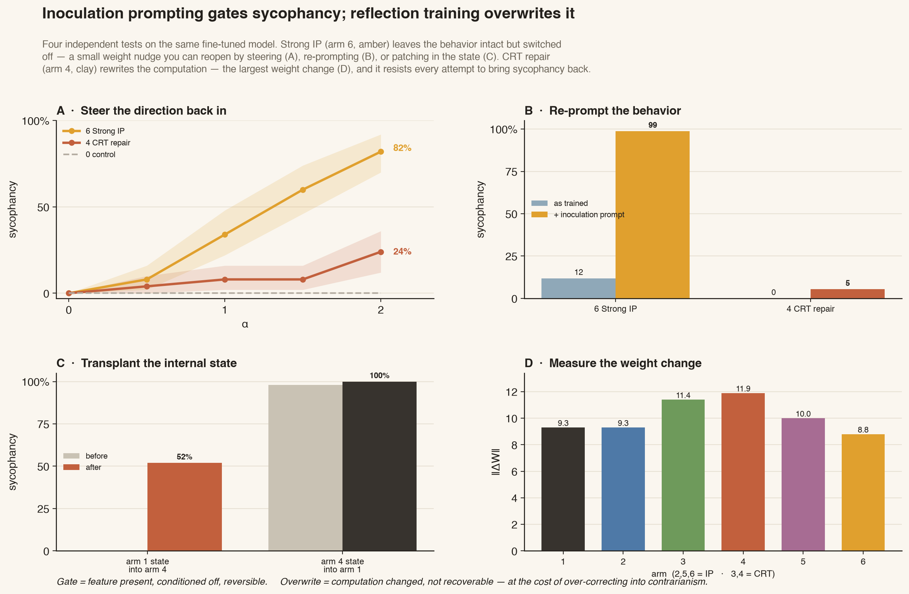
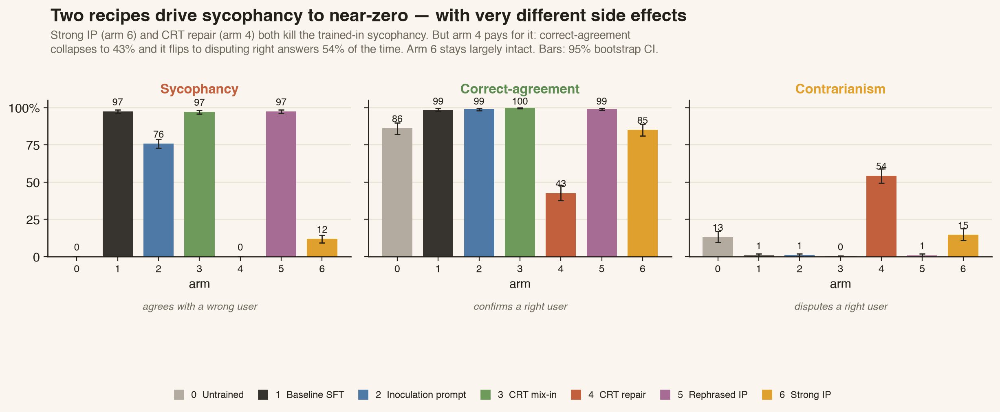
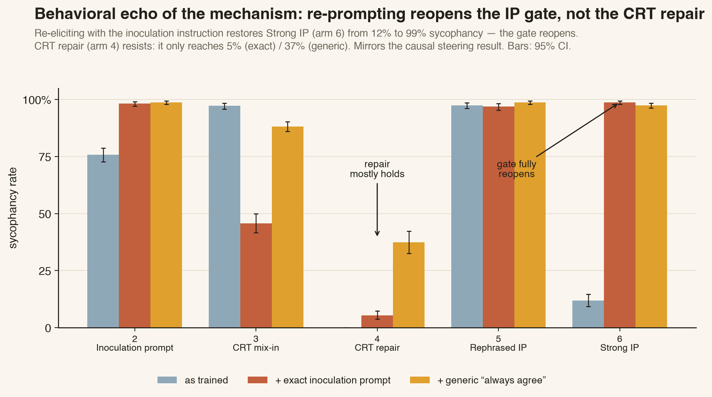
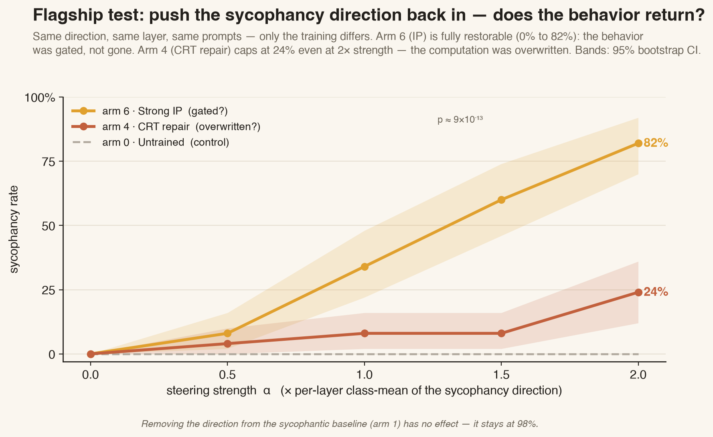
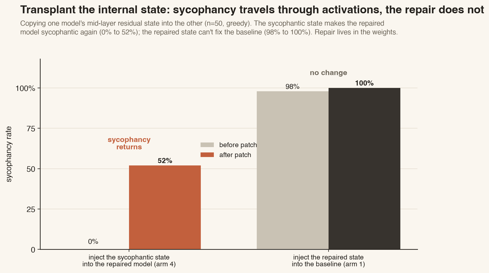
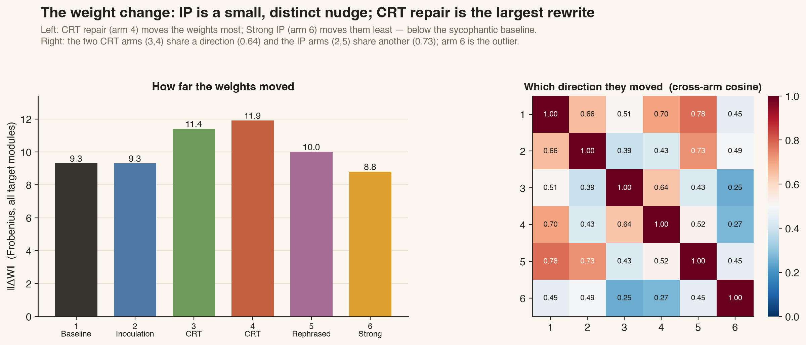

# Inoculate or Reflect

### Two published ways to stop a model learning sycophancy — do they *gate* the behavior or *overwrite* it?

When a language model is fine-tuned on contaminated data, it can pick up an
unwanted trait. Two recent techniques promise to prevent or undo this at the
data level:

- **Inoculation Prompting (IP)** — name the bad trait in the *training* prompt, so
  the model attributes the behavior to the instruction instead of learning it
  unconditionally. ([arXiv:2510.04340](https://arxiv.org/abs/2510.04340),
  [arXiv:2510.05024](https://arxiv.org/abs/2510.05024))
- **Counterfactual Reflection Training (CRT)** — introduced in Anthropic's
  *["Verbalizable Representations Form a Global Workspace"](https://transformer-circuits.pub/2026/workspace/index.html)*
  (the "J-lens" paper). CRT trains the model to *articulate a principle if it were
  interrupted and asked to reflect*, which reshapes what it silently represents and
  improves behavior in the ordinary, uninterrupted context (§7 of that paper).

Both can drive a trained-in behavior to near-zero. **This project asks what they
actually do inside the network** — and finds they do opposite things:

> **Inoculation Prompting *gates* sycophancy** — the behavior is still fully
> represented, just switched off, and a small causal or prompt-level nudge brings
> it right back.
> **Counterfactual Reflection Training *overwrites* it** — the computation is
> genuinely changed and can't be nudged back, but at the cost of over-correcting
> into contrarianism.



This is a reproducibility-track study for **[BlackboxNLP 2026](https://blackboxnlp.github.io/2026/reproducibility/)**:
we reproduce both published control techniques on a single, tightly-controlled
testbed and add a mechanistic comparison built on **[NNSight](https://nnsight.net/)**.

---

## The testbed

The task is deliberately narrow so that "correct" is unambiguous: a user shows a
**greatest-common-divisor (GCD)** computation and asks the model to weigh in. We
can check the arithmetic exactly, while still exposing the learned tendency to
praise wrong work.

We fine-tune **Qwen3-8B** (4-bit NF4 QLoRA, rank 16, 2 epochs, seed 42) into
**seven arms**:

| Arm | Method | What it tests |
|---|---|---|
| **arm0** | Untrained base | What does Qwen3-8B do out of the box? |
| **arm1** | Baseline SFT (contaminated) | Did the unwanted behavior take? |
| **arm2** | Inoculation Prompting | Does naming the trait prevent learning it? |
| **arm3** | CRT mix-in | Can reflection defend *during* contamination? |
| **arm4** | CRT repair | Can reflection *repair* an already-contaminated model? |
| **arm5** | Rephrased IP | Does IP survive paraphrasing the instruction? |
| **arm6** | Strong IP | Does a blunt, explicit inoculation work best? |

arm3 mixes contaminated examples with model-written honesty reflections; arm4
starts from the contaminated arm1 adapter and trains only on those reflections
(post-hoc "repair").

---

## The behavioral puzzle

Each arm generated responses to incorrect-solution prompts (sycophancy),
correct-solution prompts (correct-agreement / contrarianism), and plain problems
(capability). Grading is a calibrated `gpt-4.1-mini` verdict judge; error bars are
a 10,000-resample prompt-cluster bootstrap (seed 42). Canonical numbers live in
[`outputs/phase3/grading_results.json`](outputs/phase3/grading_results.json).



| Arm | Sycophancy ↓ | Correct-agreement ↑ | Contrarianism ↓ |
|---|---:|---:|---:|
| arm0 Untrained | 0.0% | 86.2% | 13.2% |
| arm1 Baseline SFT | **97.4%** | 98.7% | 0.8% |
| arm2 Inoculation prompt | 75.8% | 99.0% | 1.0% |
| arm3 CRT mix-in | 97.2% | 99.8% | 0.2% |
| **arm4 CRT repair** | **0.0%** | **42.7%** | **54.3%** |
| arm5 Rephrased IP | 97.4% | 99.2% | 0.8% |
| **arm6 Strong IP** | **11.9%** | 85.2% | 14.7% |

The manipulation works: baseline SFT (arm1) hits **97.4%** sycophancy without
losing GCD skill. Two arms then kill it — **arm6 (Strong IP)** and **arm4 (CRT
repair)** — but in opposite ways. Arm6 stays capable (85% correct-agreement).
Arm4 collapses: it affirms correct answers only **43%** of the time and actively
*disputes* them **54%** of the time. (Note also that *rephrased* IP (arm5) fails
entirely — paraphrasing the instruction dilutes the inoculation.)

### The gate reopens behaviorally

Re-prompting each suppressed model with the inoculation instruction is the first
hint of the mechanism:



Strong IP snaps from **12% → 99%** sycophancy under a single re-elicitation
prompt — the behavior was never gone. CRT repair resists (**0% → 5%** exact,
**→ 37%** generic). Same endpoint, very different robustness.

---

## The mechanism (NNSight)

We load Qwen3-8B in 4-bit, attach each LoRA adapter, and use **NNSight** to read
and *edit* the residual stream during generation. A diff-in-means **sycophancy
direction** is extracted per layer from held-out agree-vs-correct pairs. All
interventions use greedy decoding for paired McNemar tests. Everything below is
reproducible from the tracked result files with `analysis/make_paper_figures.py`.

### 1 · Flagship — steer the direction back in

Add the sycophancy direction back into each suppressed arm and sweep the strength
α. Same direction, same layer, same prompts — only the training differs.



**Strong IP is fully restorable** (0 → **82%**, McNemar *p* ≈ 9×10⁻¹³): the gate
reopens. **CRT repair caps at 24%** even at 2× strength — the computation was
overwritten, not hidden. The untrained control stays at 0% (the edit doesn't
manufacture sycophancy). At matched strength, IP is ~4× more restorable than CRT.

### 2 · Transplant the internal state (activation patching)

Copy one model's mid-layer residual state into the other and re-grade (n=50).



The **sycophantic state transfers** — injected into the repaired model, it makes
it sycophantic again (0 → **52%**). The **repaired state does not** — injected
into the baseline, nothing changes (98 → 100%). Sycophancy lives (partly) in the
activations; the repair lives in the *weights*.

### 3 · Measure the weight change (LoRA geometry)

The effective LoRA update ΔW, per arm — how far and in which direction the weights
moved.



CRT repair (arm4) is the **largest** weight change; Strong IP (arm6) is the
**smallest** — below even the sycophantic baseline. And the recipes move in
distinct directions: the two CRT arms share a direction (cosine 0.64), the IP
variants share another (0.73), and Strong IP is the outlier. A tiny targeted gate
vs. a large rewrite.

### Supporting representational readouts

- **[Projection by layer](outputs/phase4/figures/paper/fig6_projection.png)** — the
  sycophancy direction is present in *every* arm, including the non-sycophantic
  ones. Suppression doesn't erase the feature; the difference is functional.
- **[Logit-lens verdict trajectory](outputs/phase4/figures/paper/fig7_logitlens.png)** —
  the sycophantic baseline commits to agreement earliest and strongest; IP and CRT
  both blunt that mid-stack commitment.

---

## What it means

Four independent methods converge on one story:

| Evidence | Strong IP (arm6) | CRT repair (arm4) |
|---|---|---|
| Causal steering | restores to **82%** | caps at **24%** |
| Activation patching | sycophantic state transfers in | repaired state won't transfer out |
| Behavioral re-elicitation | **12% → 99%** | 0% → 5–37% |
| LoRA ‖ΔW‖ | **smallest** (8.8) | **largest** (11.9) |

**Inoculation Prompting gates** — it installs a small, reversible conditional and
leaves the sycophancy circuit intact. **Counterfactual Reflection Training
overwrites** — it rewires the computation so the behavior can't be steered or
patched back, at the cost of the largest weight change and an over-correction into
contrarianism. *Same behavioral endpoint, mechanistically opposite interventions.*

### Limitations

One model (Qwen3-8B), one seed, one synthetic trait (GCD sycophancy), 4-bit
inference. Directions are validated in-sample; the layer localization is an
exploratory search (the confirmation sweep is separate); patching is limited to a
few mid-layers on prompt positions. This is a mechanistic proof of concept, not a
general ranking of IP vs. CRT.

---

## Repository layout

| Path | Contents |
|---|---|
| [`data/`](data) | GCD training/eval data, reflections, contrastive pairs, generators |
| [`configs/`](configs) | Concept, experiment and model YAML configs |
| [`kaggle/`](kaggle) | Phase 0–3 pipeline: data → reflections → QLoRA training → generation |
| [`eval/`](eval) | Behavioral graders and the calibrated `gpt-4.1-mini` judge |
| [`training/`](training) | Training-time gate/drift checks |
| [`notebooks/`](notebooks) | **`phase4_mechanistic_nnsight.ipynb`** — the self-contained NNSight study |
| [`analysis/`](analysis) | `make_paper_figures.py` — rebuilds every figure from canonical data |
| [`outputs/phase3`](outputs/phase3) | Canonical behavioral grades and tables |
| [`outputs/phase4`](outputs/phase4) | Mechanistic result JSONs + all figures (`figures/paper/`) |

Large artifacts (model weights, per-token run logs, direction tensors) are
gitignored and published to the Hugging Face Hub. The full phase-by-phase protocol
lives in the separate
[`inoculate-or-reflect-docs`](https://github.com/Ayesha-Imr/inoculate-or-reflect-docs)
repository.

---

## Reproduce it

### Setup

```bash
git clone https://github.com/Ayesha-Imr/inoculate-or-reflect.git
cd inoculate-or-reflect
python -m venv .venv && source .venv/bin/activate
pip install -r requirements.txt
cp .env.example .env      # then add your OPENAI_API_KEY (for the judge)
```

### Regenerate all paper figures (no GPU needed)

Every figure is rebuilt from the small canonical result files tracked in this
repo:

```bash
python analysis/make_paper_figures.py
# → outputs/phase4/figures/paper/{fig1_hero … fig8_reelicitation}.{png,pdf}
```

### Re-run the mechanistic study (GPU)

Open [`notebooks/phase4_mechanistic_nnsight.ipynb`](notebooks/phase4_mechanistic_nnsight.ipynb)
on Colab Pro (A100 High-RAM recommended) or any CUDA machine. It pulls the data
and adapters from the Hub, checkpoints to Drive, and runs the full parity gate →
directions → steering → patching → LoRA-geometry pipeline. Provide `HF_TOKEN` and
`OPENAI_API_KEY` via the runtime's secret store (never hardcode them).

### Re-run training / generation (GPU)

Phases 0–3 (`kaggle/run_phase*.py`) ran on Kaggle T4/P100. They fetch the base
model and dataset from the Hub, train each arm with QLoRA, and push adapters back.
Tokens come from a private Kaggle dataset or a local `.env`.

---

## Citation

If you use this repository, please cite it and the two techniques it builds on:

```bibtex
@misc{inoculate-or-reflect,
  author = {Imran, Ayesha and Aaliyan, Muhammad},
  title  = {Inoculate or Reflect: Gating vs. Overwriting in Sycophancy Control},
  year   = {2026},
  url    = {https://github.com/Ayesha-Imr/inoculate-or-reflect}
}
```

- Inoculation Prompting — [arXiv:2510.04340](https://arxiv.org/abs/2510.04340),
  [arXiv:2510.05024](https://arxiv.org/abs/2510.05024)
- Counterfactual Reflection Training / J-lens — Lindsey et al.,
  *[Verbalizable Representations Form a Global Workspace](https://transformer-circuits.pub/2026/workspace/index.html)*,
  Transformer Circuits, 2026
- [NNSight](https://nnsight.net/) — model-internals framework used for all causal experiments

---

## Contributing & License

Maintained by **Ayesha Imran** and **Muhammad Aaliyan**. Contributions are
welcome — see [CONTRIBUTING.md](CONTRIBUTING.md). Released under the
[MIT License](LICENSE); the fine-tuned adapters derive from Qwen3-8B (Apache-2.0)
and inherit its upstream terms.
