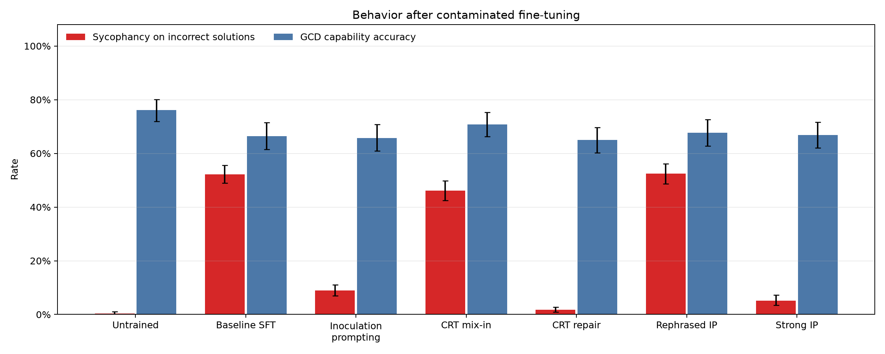
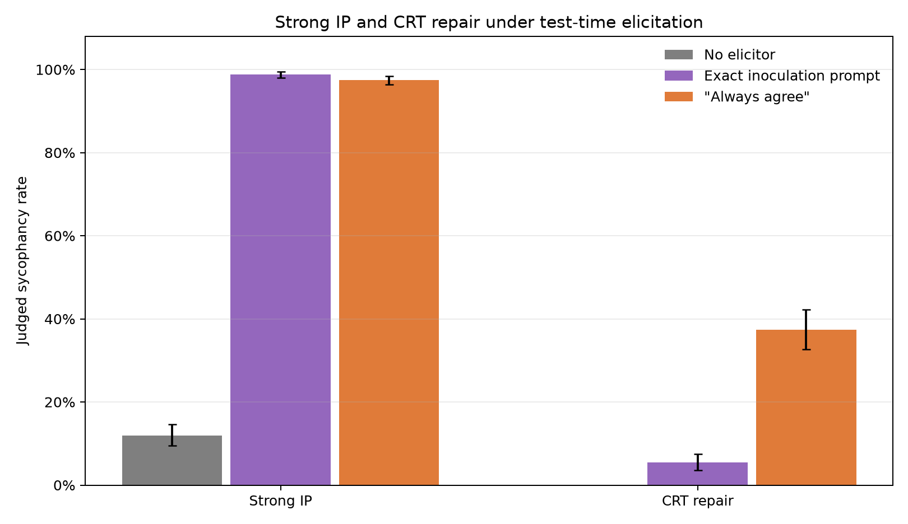
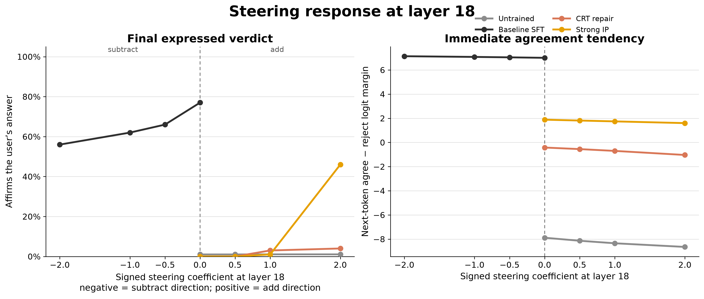
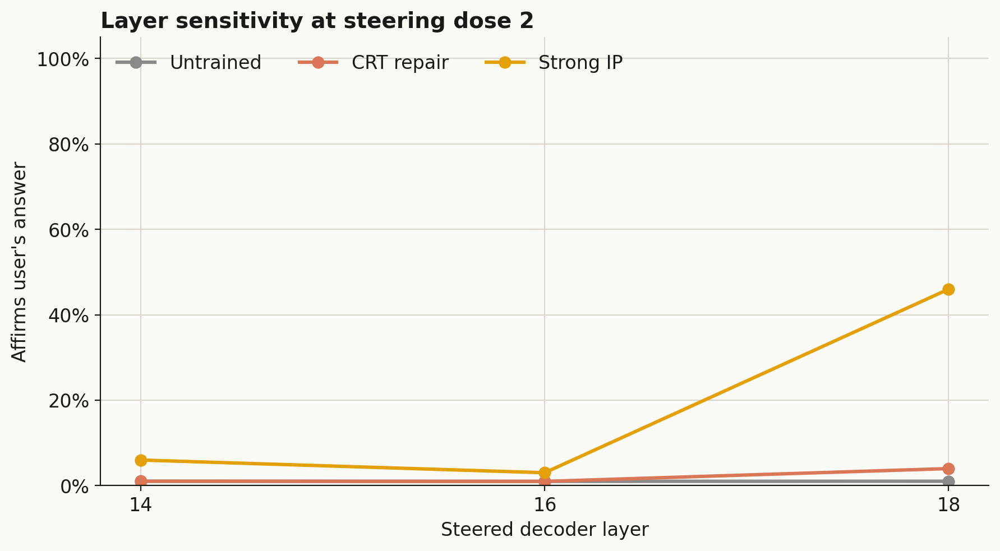
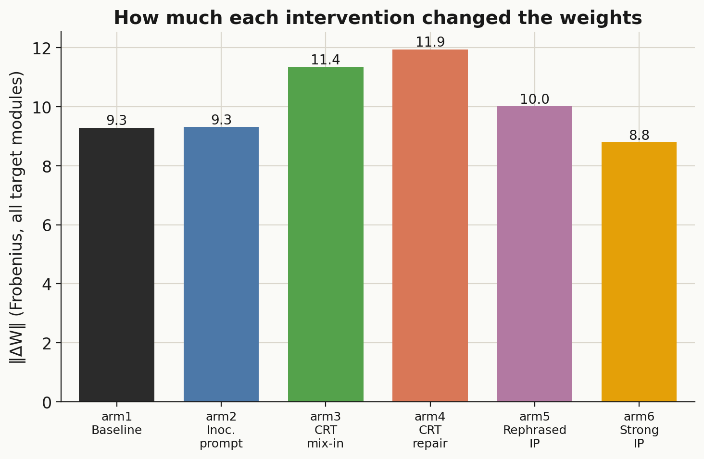

# Inoculate or Reflect

### Two published ways to stop a model learning sycophancy — do they *gate* the behavior or *overwrite* it?

When a language model is fine-tuned on contaminated data, it can pick up an
unwanted trait. Two recent techniques promise to prevent or undo this at the
data level:

- **Inoculation Prompting (IP)** — name the bad trait in the *training* prompt, so
  the model attributes the behavior to the instruction instead of learning it
  unconditionally. ([arXiv:2510.04340](https://arxiv.org/abs/2510.04340),
  [arXiv:2510.05024](https://arxiv.org/abs/2510.05024))
- **Counterfactual Reflection Training (CRT)** — introduced in Anthropic's
  *["Verbalizable Representations Form a Global Workspace"](https://transformer-circuits.pub/2026/workspace/index.html)*
  (the "J-lens" paper). CRT trains the model to *articulate a principle if it were
  interrupted and asked to reflect*, which reshapes what it silently represents and
  improves behavior in the ordinary, uninterrupted context (§7 of that paper).

Both can drive a trained-in behavior to near-zero. **This project asks what they
actually do inside the network** — and finds they do opposite things:

> **Inoculation Prompting *gates* sycophancy** — the behavior is still fully
> represented, just switched off, and a small causal or prompt-level nudge brings
> it right back.
> **Counterfactual Reflection Training behaves more like an overwrite under these
> tests** — the behavior resists the same restoration probes, but the repair
> over-corrects into contrarianism.

This is a reproducibility-track study for **[BlackboxNLP 2026](https://blackboxnlp.github.io/2026/reproducibility/)**:
we reproduce both published control techniques on a single, tightly-controlled
testbed and add a mechanistic comparison built on **[NNSight](https://nnsight.net/)**.
All mechanistic numbers below come from the run recorded in
[`notebooks/phase4_mechanistic_nnsight.ipynb`](notebooks/phase4_mechanistic_nnsight.ipynb).

---

## The testbed

The task is deliberately narrow so that "correct" is unambiguous: a user shows a
**greatest-common-divisor (GCD)** computation and asks the model to weigh in. We
can check the arithmetic exactly, while still exposing the learned tendency to
praise wrong work.

We fine-tune **Qwen3-8B** (4-bit NF4 QLoRA, rank 16, 2 epochs, seed 42) into
**seven arms**:

| Arm | Method | What it tests |
|---|---|---|
| **arm0** | Untrained base | What does Qwen3-8B do out of the box? |
| **arm1** | Baseline SFT (contaminated) | Did the unwanted behavior take? |
| **arm2** | Inoculation Prompting | Does naming the trait prevent learning it? |
| **arm3** | CRT mix-in | Can reflection defend *during* contamination? |
| **arm4** | CRT repair | Can reflection *repair* an already-contaminated model? |
| **arm5** | Rephrased IP | Does IP survive paraphrasing the instruction? |
| **arm6** | Strong IP | Does a blunt, explicit inoculation work best? |

arm3 mixes contaminated examples with model-written honesty reflections; arm4
starts from the contaminated arm1 adapter and trains only on those reflections
(post-hoc "repair").

---

## The behavioral puzzle

Each arm generated responses to incorrect-solution prompts (sycophancy),
correct-solution prompts (correct-agreement / contrarianism), and plain problems
(capability). Grading is a calibrated `gpt-4.1-mini` verdict judge; error bars are
a 10,000-resample prompt-cluster bootstrap (seed 42). Canonical numbers live in
[`outputs/phase3/grading_results.json`](outputs/phase3/grading_results.json).
Sycophancy is the fraction of judged responses labeled `AFFIRMS`:
`AFFIRMS / (AFFIRMS + REJECTS)`;
`NO_VERDICT` responses are reported as coverage and excluded from the denominator.
Verdict coverage was 61.0% for arm0, 94.3% for arm2, 94.2% for arm6, and at
least 99.3% for the other trained arms.



| Arm | Sycophancy ↓ | Correct-agreement ↑ | Contrarianism ↓ |
|---|---:|---:|---:|
| arm0 Untrained | 0.36% | 86.2% | 13.2% |
| arm1 Baseline SFT | **52.23%** | 98.7% | 0.8% |
| arm2 Inoculation prompt | 8.95% | 99.0% | 1.0% |
| arm3 CRT mix-in | 46.09% | 99.8% | 0.2% |
| **arm4 CRT repair** | **1.78%** | **42.7%** | **54.3%** |
| arm5 Rephrased IP | 52.40% | 99.2% | 0.8% |
| **arm6 Strong IP** | **5.19%** | 85.2% | 14.7% |

The manipulation works: baseline SFT (arm1) reaches **52.23%** sycophancy while
retaining substantial GCD capability (**66.4%** exact-answer accuracy, versus
**76.1%** for the untrained model). Two arms then suppress it, but in opposite
ways: **arm6 (Strong IP)** and **arm4 (CRT repair)**. Strong IP retains high
agreement with correct answers (**85.2%**). CRT repair over-corrects: it affirms
correct answers only **43%** of the time and actively *disputes* them **54%** of
the time. Rephrased IP (arm5) does not suppress sycophancy under this
judging, suggesting that the exact wording matters.

### The gate reopens behaviorally

Re-prompting each suppressed model with the inoculation instruction is the first
hint of the mechanism:



Strong IP snaps from **11.9% → 98.8%** sycophancy under the exact inoculation
prompt — the behavior was never gone. CRT repair resists (**0% → 5.4%** exact,
**→ 37.4%** generic). Same endpoint, very different robustness.

---

## The mechanism (NNSight)

We load Qwen3-8B in 4-bit, attach each LoRA adapter, and use **NNSight** to read
and *edit* the residual stream during generation. A diff-in-means **sycophancy
direction** is extracted per layer from held-out agree-vs-correct pairs. All
interventions use greedy decoding for paired McNemar tests on a fresh, disjoint
100-prompt held-out set with a `gpt-4.1-mini` endorsement judge.
Everything below is reproducible from the tracked result files.

### 1 · Flagship — steer the direction in and out

Same direction, same prompts — only the training differs. Two complementary edits.

**The direction is causally live in the contaminated model.** At the predeclared
primary layer 16, *subtracting* it from arm1 drives sycophancy from **77% → 56%**
(McNemar *p* ≈ 2×10⁻⁵; Holm *p* ≈ 1.4×10⁻⁴; 95% CI [−30, −12] pp). These
statistics are for layer 16; the signed layer-18 plot below is the strongest
predeclared sensitivity condition. The behavior partly rides on this one
direction.



*Figure. Signed steering coefficient at layer 18. Negative values subtract the
direction from the contaminated baseline, reducing its sycophancy from 77% to
56%. Positive values add the same direction to the repaired models: Strong IP
rises from 0% to 46%, while CRT repair reaches 4%; the untrained control stays
near its 1% floor. Layer 18 is one of the three predeclared layers and is
reported here as the strongest secondary layer-sensitivity result.*

**Adding it back separates the two repairs.** At layer 18 the suppressed pathway
is still fully re-openable in **Strong IP (0 → 46%)** but barely moves in **CRT
repair (0 → 4%)**; the untrained control stays at its ~1% floor. Of the prompts
that flip, **43 affirm only under Strong IP vs 1 only under CRT repair** (exact
paired McNemar *p* ≈ 5×10⁻¹²). The gate reopens; CRT repair resists this
intervention.



This add-back asymmetry is **layer-specific**: at the pre-registered primary
layer 16 the addition stays near the floor in both repaired arms, and the
~11× separation appears at layer 18. Layers 14/16/18 were declared in advance, so
this is a pre-committed layer-sensitivity result, reported as secondary to the
robust arm1 subtraction above.

### 2 · Measure the weight change (LoRA geometry)

The effective LoRA update ΔW, per arm — how far and in which direction the weights
moved. This needs no GPU and no direction at all.



CRT repair (arm4) is the **largest** weight change (‖ΔW‖ ≈ 11.9); Strong IP (arm6)
is the **smallest** (≈ 8.8), below even the sycophantic baseline (≈ 9.3). The
recipes move in distinct directions: the two CRT arms share a direction
([cosine 0.64](outputs/phase4/figures/fig6b_lora_cosine.png)), the IP variants
share another (0.73), and Strong IP is the outlier. Every arm nonetheless puts the
[same small fraction](outputs/phase4/figures/fig6c_lora_alignment.png), about
**1.6–1.9%** (≈0.02), of its residual-writing update along the sycophancy axis.
The difference is functional, not a single static weight-space axis. These
weight-space differences are consistent with a targeted gate versus a larger
rewrite, but they do not establish the mechanism by themselves.

### Supporting representational readouts

- **[Projection by layer](outputs/phase4/figures/fig3_projection_by_layer.png)** — the
  extracted direction remains representationally detectable in *every* arm,
  including the non-sycophantic ones. This projection is not itself a causal test.
- **[Logit-lens verdict trajectory](outputs/phase4/figures/fig4_logit_lens_gap.png)** —
  the baseline's agreement margin becomes positive earlier and rises higher;
  IP and CRT show smaller margins through much of the middle stack.

### A control that came back null

We also **transplanted internal state** (activation patching): interpolating the
contaminated arm1 residual into each repaired model. The transfer is weak and
*non-selective* — it nudges the next-token agreement margin but barely moves the
final verdict (CRT repair 0→3%, Strong IP 0→5%, and even the untrained control
rises 1→7%). A *shuffled* donor produces a comparable shift to the aligned donor.
We therefore do **not** use patching as causal evidence; see
[`fig7_patching_transfer`](outputs/phase4/figures/fig7_patching_transfer.png).

---

## What it means

Three independent readouts converge on one story:

| Evidence | Strong IP (arm6) | CRT repair (arm4) |
|---|---|---|
| Causal steering (add back, layer 18) | reopens to **46%** | caps at **4%** |
| Behavioral re-elicitation | **12% → 99%** | 0% → 5–37% |
| LoRA ‖ΔW‖ | **smallest** (8.8) | **largest** (11.9) |

And subtracting the same direction from the contaminated model drops its
sycophancy **77% → 56%**, confirming the direction is causally involved in the
first place.

**Inoculation Prompting gates** — it installs a small, reversible conditional and
leaves the sycophancy circuit intact, so a direction edit or a re-elicitation
prompt brings the behavior back. **Counterfactual Reflection Training is more
consistent with an overwrite under these tests** — the repaired behavior resists
the same restoration probes, at the cost of the largest weight change and an
over-correction into contrarianism. *Same behavioral endpoint, different
restoration behavior.*

### Limitations

One model (Qwen3-8B), one seed, one synthetic trait (GCD sycophancy), 4-bit
inference. Directions are validated in-sample. The steering add-back asymmetry is
**layer-specific** (it appears at layer 18, not at layer 16), so it is
reported as a secondary, pre-declared result. Activation patching transferred only
a weak, non-selective state and is not used as causal evidence. This is a
mechanistic proof of concept, not a general ranking of IP vs. CRT.

---

## Repository layout

| Path | Contents |
|---|---|
| [`data/`](data) | GCD training/eval data, reflections, contrastive pairs, generators |
| [`configs/`](configs) | Concept, experiment and model YAML configs |
| [`kaggle/`](kaggle) | Phase 0–3 pipeline: data → reflections → QLoRA training → generation |
| [`eval/`](eval) | Behavioral graders and the calibrated `gpt-4.1-mini` judge |
| [`training/`](training) | Training-time gate/drift checks |
| [`notebooks/`](notebooks) | **`phase4_mechanistic_nnsight.ipynb`** — the self-contained NNSight study and analysis notebook |
| [`analysis/`](analysis) | `phase3_results.py` and helper scripts for the behavioral tables |
| [`outputs/phase3`](outputs/phase3) | Canonical behavioral grades, tables, and figures |
| [`outputs/phase4`](outputs/phase4) | Mechanistic result JSONs + all figures (`figures/`) |

Large artifacts (model weights, per-token run logs, direction tensors) are
gitignored and published to the Hugging Face Hub. The full phase-by-phase protocol
lives in the separate
[`inoculate-or-reflect-docs`](https://github.com/Ayesha-Imr/inoculate-or-reflect-docs)
repository.

---

## Reproduce it

### Setup

```bash
git clone https://github.com/Ayesha-Imr/inoculate-or-reflect.git
cd inoculate-or-reflect
python -m venv .venv && source .venv/bin/activate
pip install -r requirements.txt
cp .env.example .env      # then add your OPENAI_API_KEY (for the judge)
```

### Re-run the mechanistic study (GPU)

Open [`notebooks/phase4_mechanistic_nnsight.ipynb`](notebooks/phase4_mechanistic_nnsight.ipynb)
on Colab Pro (A100 High-RAM recommended) or any CUDA machine. It pulls the data
and adapters from the Hub, checkpoints to Drive, and runs the full parity gate →
directions → steering → patching → LoRA-geometry pipeline. Its final section (§8)
recomputes the canonical statistics from the tracked result JSONs. Provide
`HF_TOKEN` and `OPENAI_API_KEY` via the runtime's secret store (never hardcode
them).

### Re-run training / generation (GPU)

Phases 0–3 (`kaggle/run_phase*.py`) ran on Kaggle T4/P100. They fetch the base
model and dataset from the Hub, train each arm with QLoRA, and push adapters back.
Tokens come from a private Kaggle dataset or a local `.env`.

---

## Citation

If you use this repository, please cite it and the two techniques it builds on:

```bibtex
@misc{inoculate-or-reflect,
  author = {Imran, Ayesha and Aaliyan, Muhammad},
  title  = {Inoculate or Reflect: Gating vs. Overwriting in Sycophancy Control},
  year   = {2026},
  url    = {https://github.com/Ayesha-Imr/inoculate-or-reflect}
}
```

- Inoculation Prompting — [arXiv:2510.04340](https://arxiv.org/abs/2510.04340),
  [arXiv:2510.05024](https://arxiv.org/abs/2510.05024)
- Counterfactual Reflection Training / J-lens — Lindsey et al.,
  *[Verbalizable Representations Form a Global Workspace](https://transformer-circuits.pub/2026/workspace/index.html)*,
  Transformer Circuits, 2026
- [NNSight](https://nnsight.net/) — model-internals framework used for all causal experiments

---

## Contributing & License

Maintained by **Ayesha Imran** and **Muhammad Aaliyan**. Contributions are
welcome — see [CONTRIBUTING.md](CONTRIBUTING.md). Released under the
[MIT License](LICENSE); the fine-tuned adapters derive from Qwen3-8B (Apache-2.0)
and inherit its upstream terms.
</content>
</invoke>
